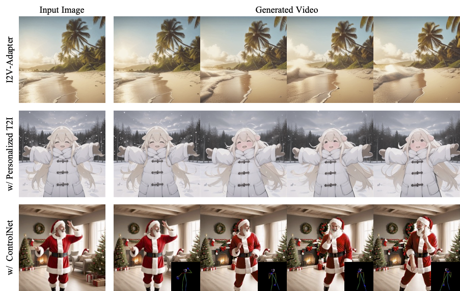

## I2V-Adapter: A General Image-to-Video Adapter for Video Diffusion Models
<a href='https://i2v-adapter.github.io'></a> 
<a href='https://arxiv.org/abs/2312.16693'></a> 
[](https://github.com/I2V-Adapter/I2V-Adapter)

<p align="left">
  
</p>


## 🔆 Introduction
This is a PyTorch/GPU implementation of the paper [I2V-Adapter: A General Image-to-Video Adapter for Video Diffusion Models](https://arxiv.org/abs/2312.16693)

✨ Code and pretrained models are coming soon, please stay tuned ✨

## 📝 Changelog
- __[2023.12.27]__: Release [I2V-Adapter](https://arxiv.org/abs/2312.16693) Technical Report!
- __[2023.12.30]__: Update repo [I2V-Adapter](https://github.com/I2V-Adapter/I2V-Adapter)

## BibTeX
If this repo is useful to you, please cite the corresponding technical paper.

```bibtex
@article{guo2023i2vadapter,
      title={I2V-Adapter: A General Image-to-Video Adapter for Video Diffusion Models}, 
      author={Xun Guo and Mingwu Zheng and Liang Hou and Yuan Gao and Yufan Deng and Chongyang Ma and Weiming Hu and Zhengjun Zha and Haibin Huang and Pengfei Wan and Di Zhang},
      journal={arXiv preprint arXiv:2312.16693},
      year={2023},
}
```

## 🤗 Acknowledgements
Codebase builds on [Diffusers](https://github.com/huggingface/diffusers) and [AnimateDiff](https://github.com/guoyww/AnimateDiff).

<!--
**I2V-Adapter/I2V-Adapter** is a ✨ _special_ ✨ repository because its `README.md` (this file) appears on your GitHub profile.

Here are some ideas to get you started:

- 🔭 I’m currently working on ...
- 🌱 I’m currently learning ...
- 👯 I’m looking to collaborate on ...
- 🤔 I’m looking for help with ...
- 💬 Ask me about ...
- 📫 How to reach me: ...
- 😄 Pronouns: ...
- ⚡ Fun fact: ...
-->
